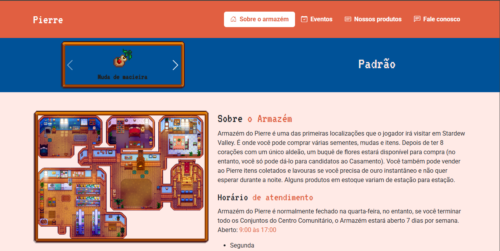
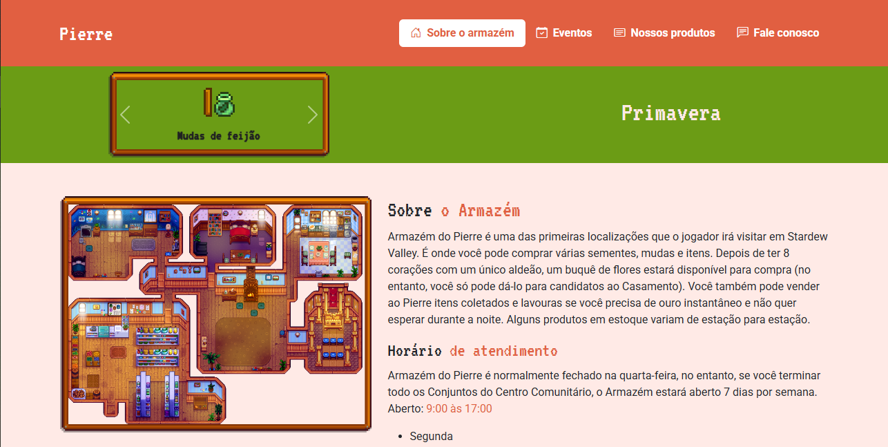
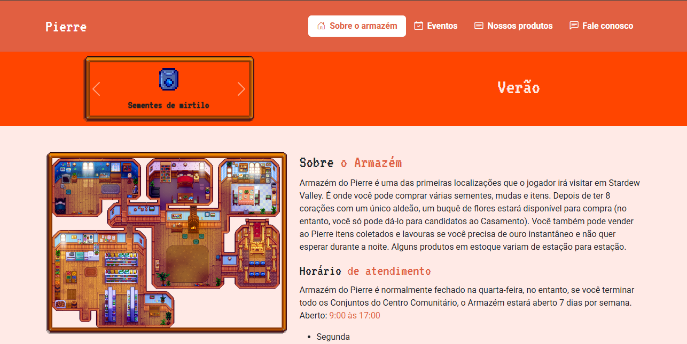
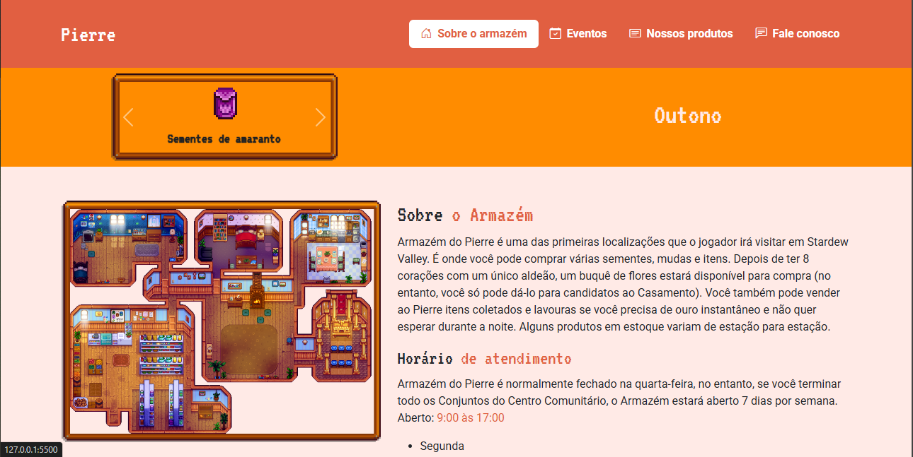
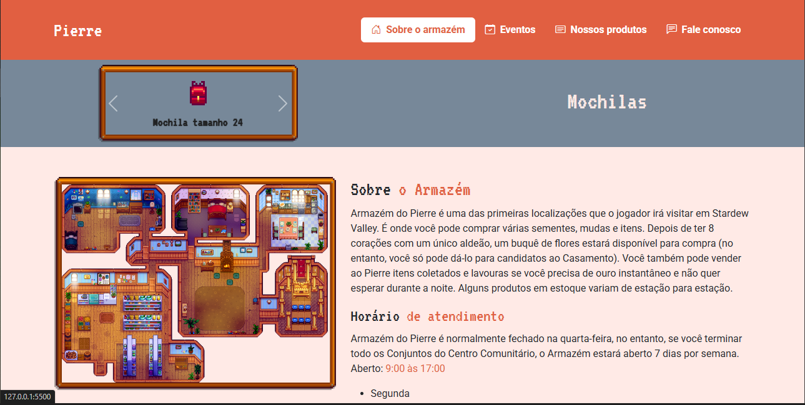
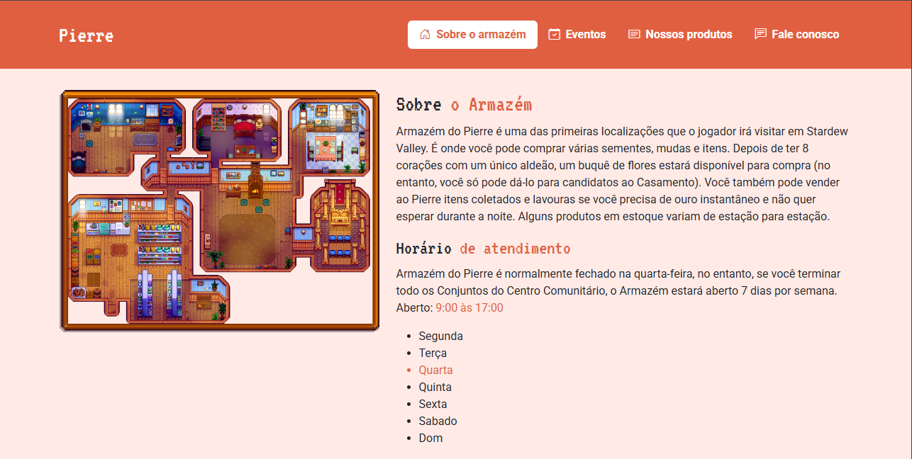
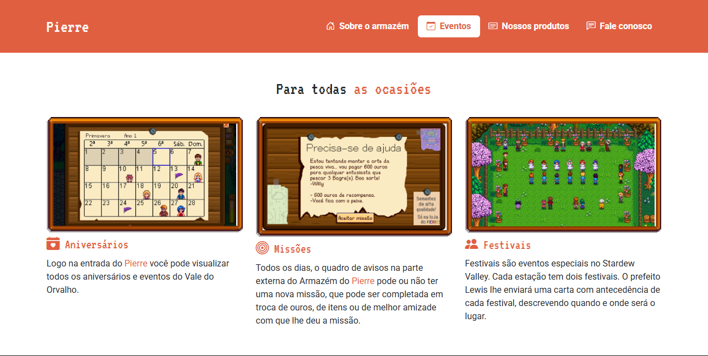
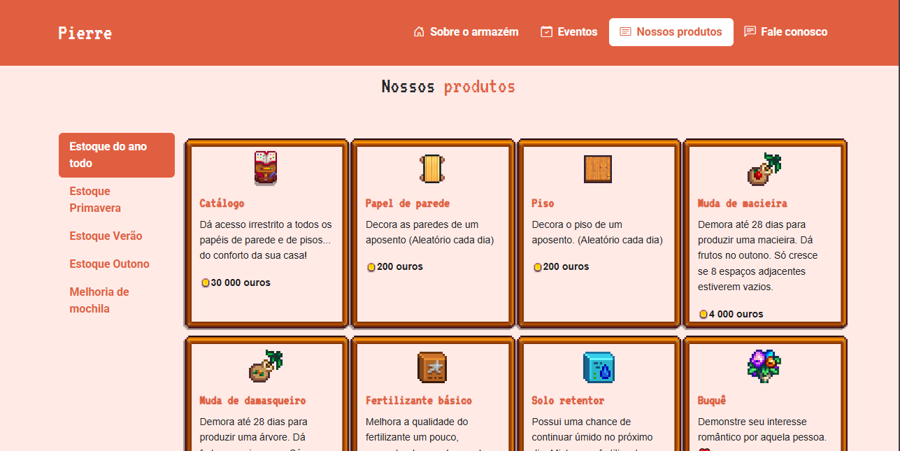
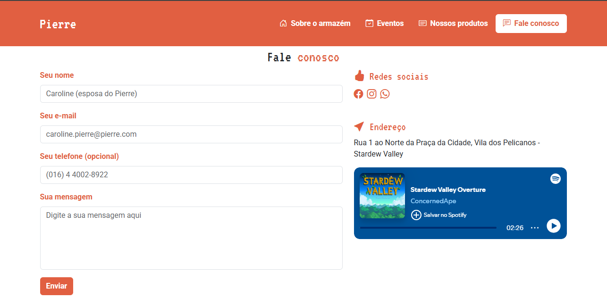

# Armazém do Pierre

## Descrição
O projeto "Armazém do Pierre" é uma página web interativa inspirada no jogo Stardew Valley, apresentando os produtos e serviços disponíveis no armazém de Pierre. Ele oferece um design responsivo e funcionalidades interativas para melhorar a experiência do usuário.

## Estrutura de Arquivos
O projeto é composto por três arquivos principais:

- **index.html**: Contém a estrutura principal do site, com seções como carrosséis de produtos, descrição do armazém e informações sobre eventos.
- **src/css/main.css**: Define o estilo visual da página, incluindo cores, fontes e responsividade.
- **src/js/main.js**: Implementa funcionalidades dinâmicas, como troca de carrosséis, animações e validações de formulário.

## Tecnologias Utilizadas
- **HTML5**
- **CSS3**
  - Uso de variáveis para cores.
  - Integração com fontes externas (Google Fonts).
  - Classes responsivas com media queries.
- **JavaScript**
  - jQuery para manipulação do DOM e eventos.
  - Validações com o plugin jQuery Validate.
  - Uso do plugin jQuery Mask para formatação de campos.
- **Bootstrap 5**
  - Layout responsivo e componentes prontos, como navbar, carrosséis e botões.

## Funcionalidades
- Exibição de produtos organizados por estação e categoria.
- Animações e efeitos visuais ao interagir com elementos.
- Validações de formulário para garantir que todos os campos obrigatórios sejam preenchidos.
- Possibilidade de selecionar produtos e enviar mensagens automáticas com detalhes do item escolhido.

## Como Executar
1. **Pré-requisitos**:
   - Um navegador moderno (Google Chrome, Firefox, Edge, etc.).
   - Conexão com a internet para carregar dependências externas do Bootstrap e jQuery.

2. **Passos**:
   - Baixe ou clone este repositório.
   - Certifique-se de que todos os arquivos estão na mesma estrutura de pastas indicada.
   - Abra o arquivo `index.html` no navegador.
3. **O deploy**
   - [Vercel link](https://armazem-do-pierre.vercel.app/)

## Estrutura do Projeto
```plaintext
├── index.html        # Estrutura principal do site
└── src/
    ├── css/
    │   └── main.css  # Estilos personalizados
    ├── js/
    │   └── main.js   # Funções interativas
    └── images/       # Imagens utilizadas na página
```

## Autor
  <table>
    <tr>
      <td align="center">
        <a href="http://github.com/BrunoAndradeDinis">
          <br>
          <sub>
            <b>Bruno de Andrade (Brinu)</b>
          </sub>
        </a>
      </td>
    </tr>
  </table>

## Licença
Este projeto é de uso livre e aberto para estudos e modificações.

## Screenshots
- Tela inicial/home





- Sobre o Armazém

- Eventos

- Produtos

- Fale conosco

